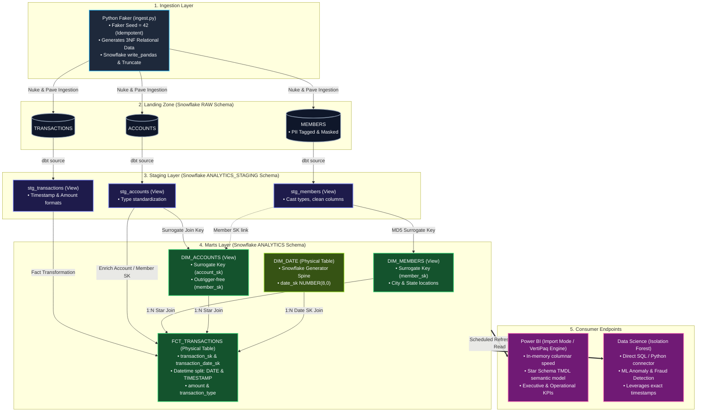

```mermaid
flowchart TD
    %% Global Styling
    classDef sourceStyle fill:#1e293b,stroke:#38bdf8,stroke-width:2px,color:#f8fafc;
    classDef rawStyle fill:#0f172a,stroke:#94a3b8,stroke-width:2px,color:#f8fafc;
    classDef stagingStyle fill:#1e1b4b,stroke:#818cf8,stroke-width:2px,color:#f8fafc;
    classDef martsStyle fill:#14532d,stroke:#4ade80,stroke-width:2px,color:#f8fafc;
    classDef consumerStyle fill:#701a75,stroke:#f472b6,stroke-width:2px,color:#f8fafc;
    classDef dateStyle fill:#365314,stroke:#a3e635,stroke-width:2px,color:#f8fafc;

    %% 1. Ingestion Layer
    subgraph INGESTION ["1. Ingestion Layer"]
        ingest_script["Python Faker (ingest.py)<br/>• Faker Seed = 42 (Idempotent)<br/>• Generates 3NF Relational Data<br/>• Snowflake write_pandas & Truncate"]:::sourceStyle
    end

    %% 2. Landing Zone
    subgraph RAW_ZONE ["2. Landing Zone (Snowflake RAW Schema)"]
        raw_members[("MEMBERS<br/>• PII Tagged & Masked")]:::rawStyle
        raw_accounts[("ACCOUNTS")]:::rawStyle
        raw_transactions[("TRANSACTIONS")]:::rawStyle
    end

    %% 3. Staging Layer
    subgraph STAGING_ZONE ["3. Staging Layer (Snowflake ANALYTICS_STAGING Schema)"]
        stg_members["stg_members (View)<br/>• Cast types, clean columns"]:::stagingStyle
        stg_accounts["stg_accounts (View)<br/>• Type standardization"]:::stagingStyle
        stg_transactions["stg_transactions (View)<br/>• Timestamp & Amount formats"]:::stagingStyle
    end

    %% 4. Marts Layer (Kimball Star Schema)
    subgraph MARTS_ZONE ["4. Marts Layer (Snowflake ANALYTICS Schema)"]
        dim_members["DIM_MEMBERS (View)<br/>• Surrogate Key (member_sk)<br/>• City & State locations"]:::martsStyle
        dim_accounts["DIM_ACCOUNTS (View)<br/>• Surrogate Key (account_sk)<br/>• Outrigger-free (member_sk)"]:::martsStyle
        dim_date["DIM_DATE (Physical Table)<br/>• Snowflake Generator Spine<br/>• date_sk NUMBER(8,0)"]:::dateStyle
        fct_transactions["FCT_TRANSACTIONS (Physical Table)<br/>• transaction_sk & transaction_date_sk<br/>• Datetime split: DATE & TIMESTAMP<br/>• amount & transaction_type"]:::martsStyle
    end

    %% 5. Consumer Endpoints
    subgraph CONSUMER_ZONE ["5. Consumer Endpoints"]
        power_bi["Power BI (Import Mode / VertiPaq Engine)<br/>• In-memory columnar speed<br/>• Star Schema TMDL semantic model<br/>• Executive & Operational KPIs"]:::consumerStyle
        data_science["Data Science (Isolation Forest)<br/>• Direct SQL / Python connector<br/>• ML Anomaly & Fraud Detection<br/>• Leverages exact timestamps"]:::consumerStyle
    end

    %% Pipeline Flow Relationships
    ingest_script -->|Nuke & Pave Ingestion| raw_members
    ingest_script -->|Nuke & Pave Ingestion| raw_accounts
    ingest_script -->|Nuke & Pave Ingestion| raw_transactions

    raw_members -->|dbt source| stg_members
    raw_accounts -->|dbt source| stg_accounts
    raw_transactions -->|dbt source| stg_transactions

    stg_members -->|MD5 Surrogate Key| dim_members
    stg_accounts -->|Surrogate Join Key| dim_accounts
    stg_members -.->|Member SK link| dim_accounts

    stg_transactions -->|Fact Transformation| fct_transactions
    stg_accounts -->|Enrich Account / Member SK| fct_transactions

    dim_members -->|1:N Star Join| fct_transactions
    dim_accounts -->|1:N Star Join| fct_transactions
    dim_date -->|1:N Date SK Join| fct_transactions

    %% Marts to Consumers
    MARTS_ZONE ==>|Scheduled Refresh / Direct Read| power_bi
    MARTS_ZONE ==>|Feature Extraction / Analysis| data_science
```